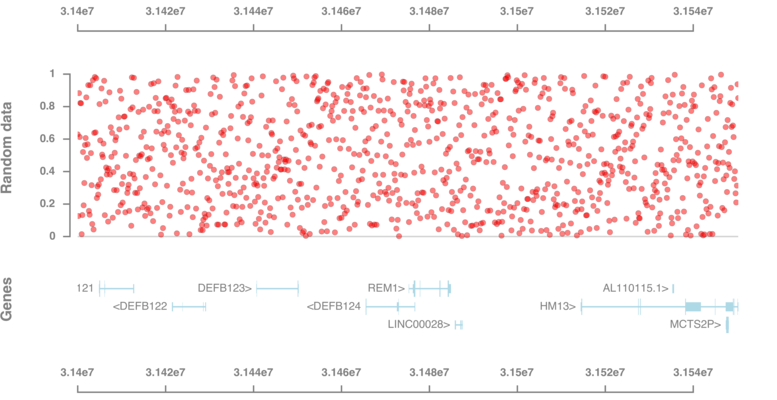
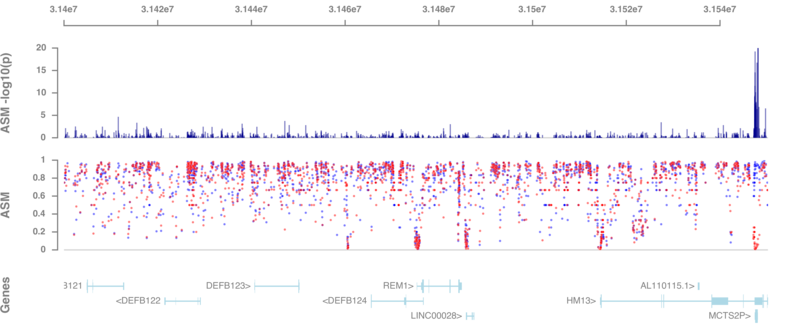

# GViz.jl

```@contents
```

## Purpose

GViz.jl is a julia library to visualize genomic data using tracks.
The library is implemented on top of the Cairo vector graphics library.

The user specifies track objects

- `GenomicAxis`
- `DataTrack` (for x, y data)
- `GeneTrack` (for genes)

that are plotted to a PDF file using `plotTracks`.


Internally, each display consists of a number of nested reference
frames. Each reference frame has a coordinate system and an
environment for parameters.  Both attributes and data are stored in
the environment. A child reference frame is mapped onto its parent
reference frame using scaling and translation transformations. When
trying to look up an attribute in a reference frame's environment that
does not exists there, its parents' environments are checked
recursively.


## Examples

```
using GViz

chrom_ = "chr20"
bpStart_ = 31400000
bpEnd_ = 31550229

gp = GenomicAxis(;height=1cm, margin_top = 8mm)
gt = GeneTrack(chrom_, bpStart_, bpEnd_)
dt = DataTrack(x = range(bpStart_, bpEnd_, length=1000), y = rand(1000),
               ymin = -0.05, ymax = 1.05, title = "Random data", height=5cm )

plotTracks([gp, dt, gt, gp], "/tmp/test1.pdf", bpStart_, bpEnd_;
	   defaultparams..., width=20cm)
```




```
using GViz
using GorJulia

chrom_ = "chr20"
bpStart_ = 31400000
bpEnd_ = 31550229

gp = GenomicAxis(;height=1cm, margin_top = 8mm)

gt = GeneTrack(chrom_, bpStart_, bpEnd_)

hmeth = GorFile(GViz.pkgpath("data", "PofO_ASM.gor");
                first = (chrom_, bpStart_), last = (chrom_, bpEnd_)) |> Tables.columns

hmt = DataTrack(x = hmeth[:Pos],
                layers = [Dict(:y => hmeth[:mfrac], :fill => "blue"),
                          Dict(:y => hmeth[:pfrac], :fill => "red")],
                ymin=0, ymax = 1, title="ASM",
                size=1, margin_top=0mm, color="white")

zt = DataTrack(x = hmeth[:Pos], y = -log10.(hmeth[:pval]),
               ymin=0, ymax = 20, title="ASM -log10(p)",
               size=1, margin_top=0mm, geom = :col, color = "darkblue")

plotTracks([gp, zt, hmt, gt], "/tmp/test2.pdf", bpStart_, bpEnd_; defaultparams..., width=25cm)

```



## API

```@docs
GenomicAxis
DataTrack
GeneTrack
plotTracks
```


